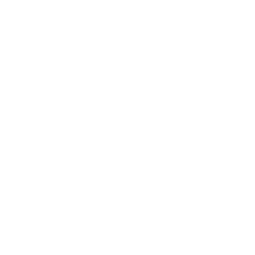
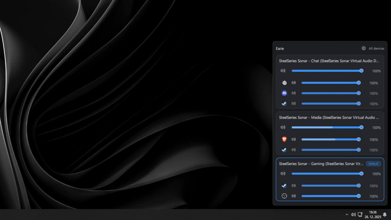

<p align="center">
  <br>
  <strong>Earie</strong><br>
  <em>
    Per-app volume mixer for Windows inspired by
    <a href="https://eartrumpet.app/" target="_blank" rel="noopener noreferrer">
      EarTrumpet
    </a>
  </em>
</p>

<p align="center">
  
</p>

> [!NOTE]
> **AI-assisted development:** This app was built with the help of AI tools.
> While it is actively tested and continuously improved, you may encounter bugs.
> Feedback for issues is greatly appreciated. Please open an issue report if you find one and we’ll work to fix it.


## Features
- Hide devices
- Hide processes
- Sort devices
- Show only the default device

## Download

Prebuilt binaries are available from [Releases](https://github.com/tfourj/earie/releases):

- **Earie-Setup.exe** — recommended  
  Installer with Start Menu entry and auto-updates support.
- **Earie.zip** — portable  
  No installation required. Extract and run.

> [!NOTE]
> Portable builds do not install system integration (Start Menu, uninstall entry).

## Build
<sub>Development environment used:</sub>
- Windows 11, Qt 6.8+, Qt Creator, Qt 6.10.1 MinGW kit
- Open `CMakeLists.txt` in Qt Creator, and build the project.

The app starts tray-only. Left-click the tray icon toggles the flyout; right-click shows the context menu.

## Config (JSON)

Stored at:
- `%APPDATA%/Earie/config.json`

Schema (v1):

```json
{
  "schemaVersion": 1,
  "mode": "default",                // "default" | "all"
  "showSystemSessions": false,      // default false
  "hiddenDevices": ["<deviceId>"],
  "hiddenProcessesGlobal": ["C:\\Path\\App.exe"],
  "hiddenProcessesPerDevice": {
    "<deviceId>": ["C:\\Path\\App.exe"]
  }
}
```

Notes:
- Devices are hidden by IMMDevice id (stable string from `IMMDevice::GetId`).
- Processes are hidden by full exe path (preferred), resolved from session PID.

## Contributing

Pull requests are welcome! So feel free to open them.

## License

This project is licensed under the GPLv3 - see the [License](LICENSE) file for details.